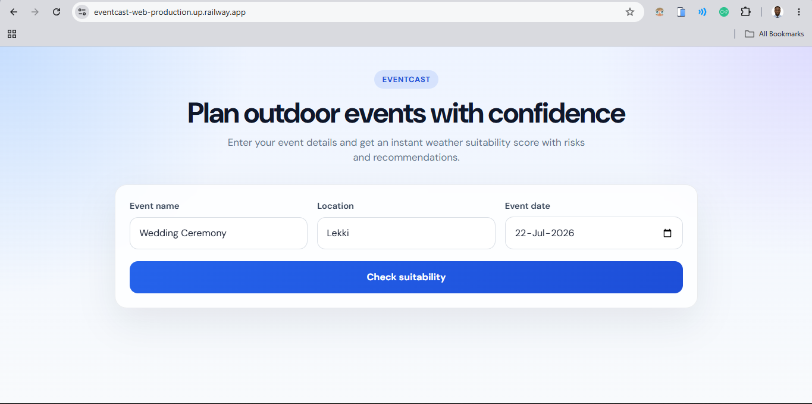
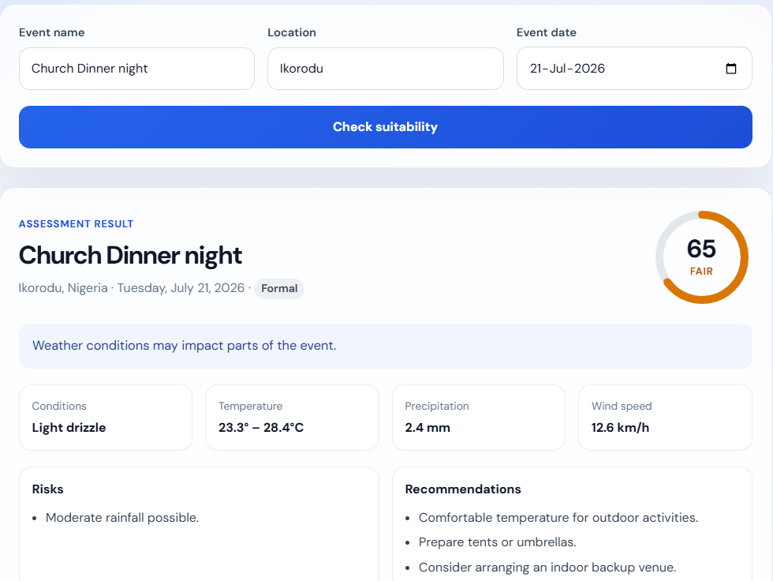
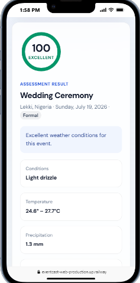
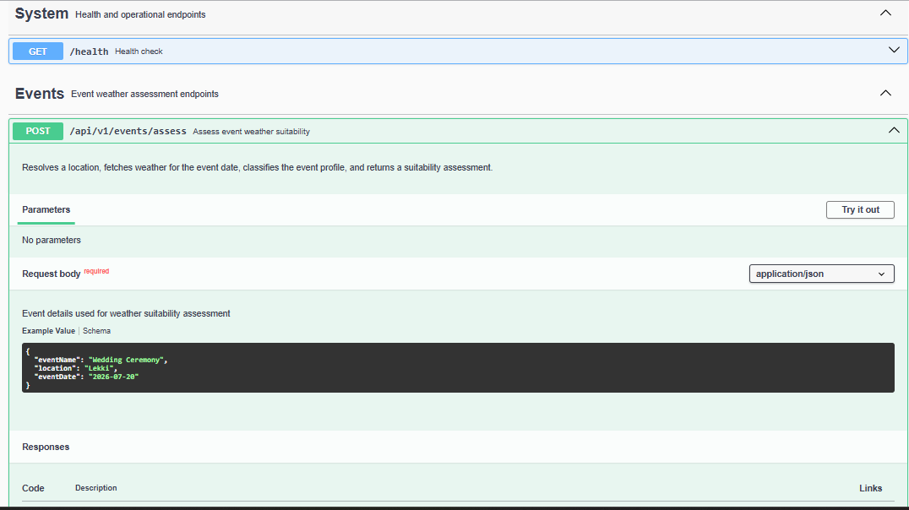

# EventCast

EventCast helps you decide whether the weather is suitable for an outdoor event. Enter an event name, location, and date — the app geocodes the place, pulls a forecast, classifies the event type, and returns a suitability score with risks and recommendations.

---

## What it does

1. **Resolves the location** (city/place → coordinates) via Open-Meteo Geocoding
2. **Fetches weather** for the event date via Weather AI
3. **Classifies the event** (formal, casual, sports, adventure, entertainment, or general) from keywords in the name
4. **Scores suitability** using a rules-based engine that weighs temperature, rain, wind, and event-specific factors

The result includes a **0–100 score**, a **rating** (Excellent / Good / Fair / Poor), a **summary**, plus **risks** and **recommendations**.

---

## Screenshots

### Web app — homepage

The assessment form: enter an event name, location, and date to check weather suitability.



### Web app — assessment result

Score, rating, weather stats, risks, and recommendations after submitting an event.



### Web app — mobile view

Responsive layout on smaller screens.



### API documentation

Interactive Swagger UI for exploring and testing endpoints.



---

## Repository structure

```
EventCast/
├── backend/          # Express API, suitability engine, OpenAPI docs
├── frontend/         # React + Vite single-page UI
├── screenshots/      # App and API documentation screenshots
└── README.md         # This file
```

| Part | Role | Docs |
| ---- | ---- | ---- |
| [backend](./backend) | REST API, validation, scoring engine, Swagger | [backend/README.md](./backend/README.md) |
| [frontend](./frontend) | Web UI that calls `/api/v1/events/assess` | [frontend/README.md](./frontend/README.md) |

---

## Prerequisites

- **Node.js** 18+
- **npm**
- **Weather AI API key** — [api.weather-ai.co](https://api.weather-ai.co)

Geocoding uses Open-Meteo (no API key required).

---

## Quick start

### 1. Backend

```bash
cd backend
npm install
cp .env.example .env
```

Set in `.env`:

```env
PORT=3000
WEATHER_AI_API_KEY=wai_live_your_key_here
WEATHER_AI_BASE_URL=https://api.weather-ai.co/v1
```

Start the API:

```bash
npm run dev
```

- API: **http://localhost:3000**
- Swagger UI: **http://localhost:3000/api-docs**
- Health: **http://localhost:3000/health**

### 2. Frontend

In a second terminal:

```bash
cd frontend
npm install
npm run dev
```

Open **http://localhost:5173**

The frontend dev server proxies `/api` to the backend, so no extra CORS setup is needed locally.

---

## Example API usage

```bash
curl -X POST http://localhost:3000/api/v1/events/assess \
  -H "Content-Type: application/json" \
  -d '{
    "eventName": "Wedding Ceremony",
    "location": "Lekki",
    "eventDate": "2026-07-20"
  }'
```

**Sample response:**

```json
{
  "success": true,
  "data": {
    "event": {
      "name": "Wedding Ceremony",
      "profile": "formal",
      "date": "2026-07-20"
    },
    "location": {
      "city": "Lekki",
      "country": "Nigeria"
    },
    "weather": {
      "date": "2026-07-20",
      "maxTemperature": 27,
      "minTemperature": 24.8,
      "precipitation": 3,
      "windSpeed": 13,
      "weatherCode": 53
    },
    "assessment": {
      "score": 65,
      "rating": "Fair",
      "summary": "Weather conditions may impact parts of the event.",
      "risks": ["Moderate rainfall possible."],
      "recommendations": [
        "Comfortable temperature for outdoor activities.",
        "Prepare tents or umbrellas.",
        "Consider arranging an indoor backup venue."
      ]
    }
  }
}
```

---

## Architecture overview

```
┌─────────────┐     POST /assess      ┌──────────────────────────────────────┐
│   Frontend  │ ────────────────────► │            Backend API               │
│  React/Vite │                       │                                      │
└─────────────┘                       │  Validate → Geocode → Weather       │
       ▲                              │           → Classify → Score         │
       │         JSON assessment      │                                      │
       └──────────────────────────────┤  Suitability Engine (rules-based)    │
                                      └──────────┬─────────────┬─────────────┘
                                                 │             │
                                    Open-Meteo Geocoding   Weather AI
```

**Backend highlights**

- Express 5 + TypeScript
- Zod validation with OpenAPI docs from the same schemas
- Profile-aware suitability engine (`backend/src/engine/suitability.engine.ts`)
- Retries for transient geocoding failures

**Frontend highlights**

- Single-page form + results view
- Score ring, weather stats, risks, and recommendations
- Dev proxy to the API

---

## Event profiles

Events are inferred from the name and scored differently:

| Profile | Example keywords |
| ------- | ---------------- |
| Formal | wedding, conference, graduation |
| Casual | birthday, picnic, party |
| Sports | football, marathon, volleyball |
| Adventure | camping, hiking, trek |
| Entertainment | concert, festival, show |
| General | fallback when no keyword matches |

See [backend/README.md](./backend/README.md#event-profiles--suitability-engine) for the full scoring rules.

---

## Tech stack

| Layer | Technologies |
| ----- | ------------ |
| Backend | Node.js, Express 5, TypeScript, Zod, Axios |
| API docs | `@asteasolutions/zod-to-openapi`, Swagger UI |
| Frontend | React 19, Vite, TypeScript |
| External APIs | Open-Meteo Geocoding, Weather AI |

---

## Production build

**Backend**

```bash
cd backend
npm run build
npm start
```

**Frontend**

```bash
cd frontend
npm run build
npm run preview   # or serve dist/ with any static host
```

Set `VITE_API_URL` to your deployed API URL when building the frontend for production.

---

## Further reading

- [Backend README](./backend/README.md) — endpoints, validation, engine rules, env vars, Swagger
- [Frontend README](./frontend/README.md) — UI setup and configuration

---

## License

ISC (per package manifests).
